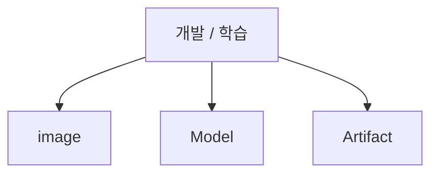
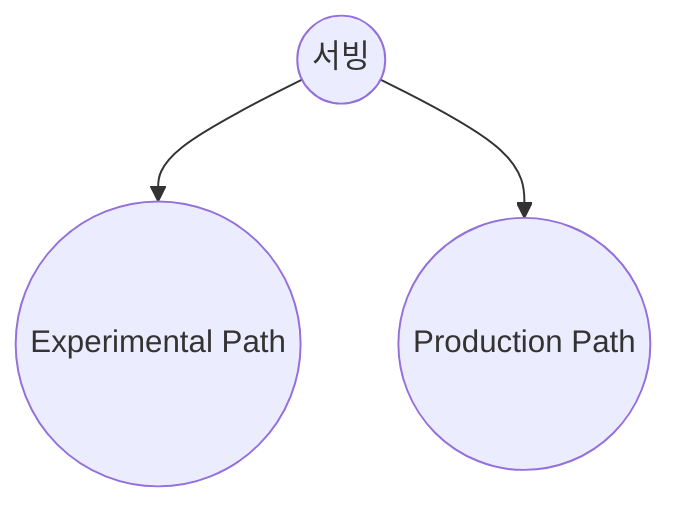
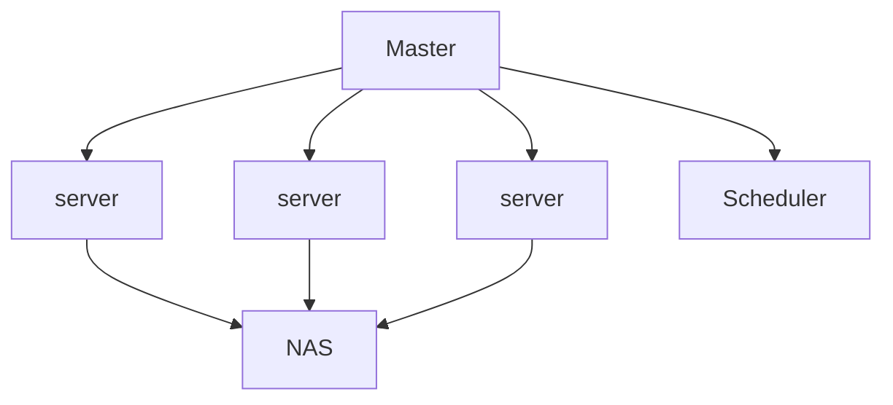

# ML Ops

많은 기업들의 머신러닝 수요가 증가했습니다.
기업들은 머신러닝을 기업의 중요한 결정을 하는 것에 사용 하기도 하고 유저들에게 서비스를 제공하기 위해서 사용하기도 합니다.
따라서 ML Ops 또한 매우 중요한 영역으로 자리 잡았습니다.

## 정의
**NVIDIA**: 기업이 AI를 활용하기 위한 최적의 방식들의 집합이다. 
**Google**: ML 시스템 개발과 ML 시스템 운영을 통합하는 것을 목표로하는 ML 엔지니어링 문화 및 방식이다. 

**내 생각**: 전체적인 머신러닝 시스템에 관여하여 리소스 관리, 모니터링을 통하여 모델 유지 및 관리를 하고 자동화를 통한 모델 배포 과정 간소화하여 최종적으로 모델의 배포까지 도와주는 시스템.

## 특징

 1. 리소스를 모니터링하며 리소스를 효율적으로 운용
 2. 데이터 수집, 테스트, 배포를 자동화하여 효율적인 모델 개발 가능
 3. 모델을 모니터링하여 지속적인 모델 성능 유지/개선 및 아웃라이어 감지

**모델 모니터링, 리소스 모니터링, 자동화**

모델 모니터링: 많은 양의 데이터가 계속 들오고 시대가 빠르게 변하기 때문에 모델 성능을 지속적으로 감시하는 것은 중요합니다.
 
 
리소스 모니터링: 리소스 관리가 효율적으로 된다면 많은 시간을 단축할 수 있습니다. 모델 혹은 서비스에 맞게 리소스를 효율적으로 분배해주는 것은 중요합니다.
 
 
자동화: 자동화는 데이터 버저닝, 전처리, 모델 평가와 배포 등, 반복적인 일을 자동으로 실행시켜주며 모델의 성능에 집중시켜줘서 전체적인 시간을 줄이고 효율을 높일 수 있습니다.

### 레이어
개발 / 학습 - model, image (docker), artifact
서빙 - Experimental Path, Production Path

## ML Ops 흐름
Monolithic Architecture에서 MSA로 넘어가면서 MSA를 편하게 사용하기 위해 Docker를 쓰게 되었다. Docker를 쓰다보니 이 많은 컨테이너들을 잘 관리할 수 있는 툴이 필요했는데 이 툴이 kubernetes이다.  
> MSA --> Docker --> Kubernetes
 

**ML Ops에서의 K8S**

1. 각각의 서버에 접속 후 모니터링 작업 감소
2. 서버별 환경을 동일하게 가능
3. 자원관리 용이
4. 학습 결과를 한 곳에서 확인 가능
5. 특정 서버에 장애가 발생해도 문제가 되지 않음
6. On-premise / Cloud 서버 구분 없이 통합 관리 가능

 

## ML Ops 플랫폼
이렇게 넓은 분야의 지식을 필요로 하고 많은 기술들이 합쳐져 있는 ML Ops를 도와주는 플랫폼들이 있다. 

**ML Ops 플랫폼들의 기능**

 - 데이터 관리
 - 모델 모니터링
 - 모델 관리와 모델 배포
 - 프로젝트와 리소스 관리

**Kubeflow**

Kubeflow는 K8S에서 머신러닝 개발 / 학습을 가능하게 해주는 머신러닝 파이프라인과 Orchestration Tool을 제공하는 무료 플랫폼입니다. Tensorflow와 호환이 잘되며 다른 프레임워크 (Pytorch, Apache MXNet)등과도 같이 이용할 수 있습니다. Kubeflow는 사용자가 원하는대로 다양하게 확장이 가능하며 자유도가 높습니다. 

Kubeflow의 장점으로는 오픈소스, 머신러닝 파이프라인과, orchestration tool을 제공한다는 점이있습니다. 또한 직관적인 UI로 사용자들이 이용하기 쉽게 해주고 원하는 서비스에 맞게 Customization이 가능합니다.
하지만 단점으로는 개발/학습과 서빙이 따로 구성되어 있지 않은 부분과 데이터 수집 및 관리에 대한 기능이 명확하지 않다는 점이 있습니다.

**SageMaker, Google AI Platform, Azure Machine Learning**

이 세 플랫폼들은 비슷하게 PaaS를 제공합니다. 다른 점은 이 플랫폼들은 각각의 제품들을 사용하여야 한다는 것입니다. 이 플랫폼들은 오픈소스를 포함한 다양한 써드 파티 도구들을 사용할 수 있습니다. 장점으로는 자사 클라우드 서비스들과 연동이 된다는 점과 다른 오픈소스 도구들과 커스텀이 된다는 점입니다. 하지만 멀티 클라우드와 하이브리드 배포절차가 제한적이고 정상적으로 쓰려면 해당 플랫폼의 조사가 많이 필요하고 전문가가 필요합니다. 폐쇄적인 환경 때문에 보통 진입장벽이 낮지 않는다는 점도 단점 중에 하나입니다. 세 플랫폼 모두 해당 IDE를 제공합니다.

**Determined AI**

Determined AI는 편리한 하이퍼파라미터 튜닝, 효율적인 job scheduling, 클러스터 관리, 모델 학습 툴들, 로그 관리, 모델 결과 visualization 등 다양한 기능을 가지고 있습니다. 그리고 또 Determined AI는 클라우드와 로컬 환경, 둘 다 이용이 가능합니다. 하지만 데이터 관리를 해주는 도구와 모델을 제공하는 도구가 기본으로 제공되지 않는다는 점이 단점입니다.

**FloydHub**

FloydHub은 딥러닝 프로젝트들을 위한 클라우드 기반의 IDE를 사용하고 여기에 더해 모델 개발, 학습, 배포등을 할 수 있는 도구들을 제공합니다. 이 플랫폼은 주피터랩을 사용할 수 있고 다양한 프레임워크들을 사용할 수 있습니다. 하지만 큰 단점으로는 자동화된 학습 파이프라인이 제공되지 않는다는 점입니다.

**H2o.ai**
h2o.ai는 모델 학습과 배포까지 가능한 오픈소스 플랫폼이며 UI가 매우 직관적인 편입니다. 사용하기 편리하고 Documentaion이 잘되어있다는 장점이 있습니다. 하지만 단점으로는 도커들을 이용하기 어렵다는 점과 모델의 학습이 visualization이 되지 않는다는 점이 있습니다.

ML Ops 플랫폼을 제공할 때 중요한 것

- 자유도가 높고 다른 도구들과 연계하여 사용하는 것이 용이
- user-friendly document
- 유저들에게 친절한 UI (진입장벽이 낮음)
- Migration

얼마나 사용할 수 있는 도구들이 많고 성능이 얼마나 중요한지도 매우 중요한 부분이지만 제가 생각하기에는 ML Ops 플랫폼을 제공할 때 가장 중요한 것은 자유도가 높고 이미 있는 툴들과 얼마나 잘 호환이 되는지와 사용자들이 쉽게 사용할 수 있어야 한다고 생각합니다. 2021년 기준 SageMaker가 가장 높은 점유율을 가지고 있습니다. SageMaker가 비교적 폐쇄적이고 자체 IDE를 사용하여 Migration이 쉽지 않지만 점유율이 높은 이유는 물론 성능도 좋고 사용할 수 있는 도구들도 많이 있지만 documentation과 사용자들이 많아 참고할 수 있는 레퍼런스도 많은 것도 중요한 역할을 한다고 생각합니다. 
