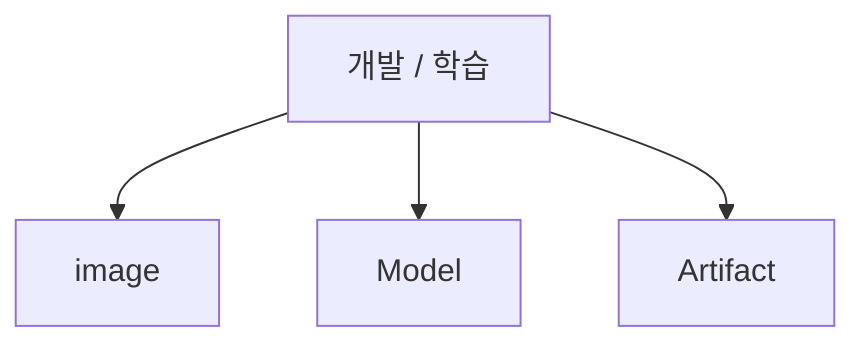
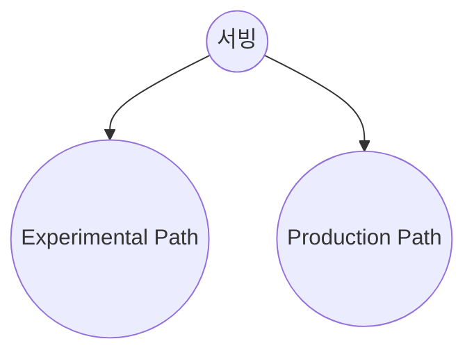
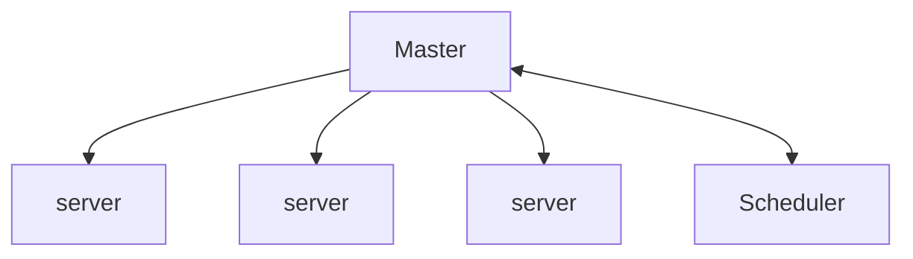

# ML Ops

많은 기업들의 머신러닝 수요가 증가했습니다.
기업들은 머신러닝을 기업의 중요한 결정을 하는 것에 사용 하기도 하고 유저들에게 서비스를 제공하기 위해서 사용하기도 합니다.
따라서 ML Ops 또한 매우 중요한 영역으로 자리 잡았습니다.

## 정의
**NVIDIA**: 기업이 AI를 활용하기 위한 최적의 방식들의 집합이다. 
**Google**: ML 시스템 개발과 ML 시스템 운영을 통합하는 것을 목표로하는 ML 엔지니어링 문화 및 방식이다. 

**내 생각**: 전체적인 머신러닝 시스템에 관여하여 리소스 관리, 모니터링, 자동화를 통하여 사이언티스트들이 모델 개발을 효율적으로할 수 있게 도와주는 시스템이다.

## 특징

 1. 리소스를 모니터링하며 리소스를 효율적으로 운용
 2. 데이터 수집, 테스트, 배포를 자동화하여 효율적인 모델 개발 가능
 3. 모델을 모니터링하여 지속적인 모델 성능 유지/개선 및 아웃라이어 감지

**모델 모니터링, 리소스 모니터링, 자동화**

모델 모니터링: 많은 양의 데이터가 계속 들오고 시대가 빠르게 변하기 때문에 모델 성능을 지속적으로 감시하는 것은 중요합니다.
 
 
리소스 모니터링: 리소스 관리가 효율적으로 된다면 많은 시간을 단축할 수 있습니다. 모델 혹은 서비스에 맞게 리소스를 효율적으로 분배해주는 것은 중요합니다.
 
 
자동화: 자동화는 데이터 버저닝, 전처리, 모델 평가와 배포 등, 반복적인 일을 자동으로 실행시켜주며 모델의 성능에 집중시켜줘서 전체적인 시간을 줄이고 효율을 높일 수 있습니다.

### 레이어
개발 / 학습 - model, image (docker), artifact
서빙 - Experimental Path, Production Path

## ML Ops 흐름
Monolithic Architecture에서 MSA로 넘어가면서 MSA를 편하게 사용하기 위해 Docker를 쓰게 되었다. Docker를 쓰다보니 이 많은 컨테이너들을 잘 관리할 수 있는 툴이 필요했는데 이 툴이 kubernetes이다.  
> MSA --> Docker --> Kubernetes
 

**ML Ops에서의 K8S**

1. 각각의 서버에 접속 후 모니터링 작업 감소
2. 서버별 환경을 동일하게 가능
3. 자원관리 용이
4. 학습 결과를 한 곳에서 확인 가능
5. 특정 서버에 장애가 발생해도 문제가 되지 않음
6. On-premise / Cloud 서버 구분 없이 통합 관리 가능

 

## ML Ops 플랫폼
이렇게 넓은 분야의 지식을 필요로 하고 많은 기술들이 합쳐져 있는 ML Ops를 도와주는 플랫폼들이 있다. 

**ML Ops 플랫폼들의 기능**

 - 데이터 관리
 - 모델 모니터링
 - 모델 관리와 모델 배포
 - 프로젝트와 리소스 관리

**Kubeflow**

장점:

- 무료, 오픈소스
- 머신러닝 파이프라인, orchestration tool 제공
- 직관적인 UI
- Customization 용이
 
단점:

- 개발 / 학습과 서빙이 따로 구성되어 있음
- 데이터 수집/관리에 대한 기능이 명확하지 않음

**SageMaker, Google AI Platform, Azure Machine Learning**

장점:

- 클라우드 서비스들과 연동 가능
- 다른 도구들과 커스텀 가능
 
단점:

- 멀티 클라우드와 하이브리드 배포절차가 제한적임
- 정상적으로 쓰려면 해당 제품의 조사가 많이 필요함 (진입장벽이 낮지 않음)
- 폐쇄적
 

ML Ops 플랫폼을 제공할 때 중요한 것

- 자유도가 높고 다른 도구들과 연계하여 사용하는 것이 용이
- user-friendly document
- 유저들에게 친절한 UI (진입장벽이 낮음)
- Migration

얼마나 사용할 수 있는 도구들이 많고 성능이 얼마나 중요한지도 매우 중요한 부분이지만 제가 생각하기에는 ML Ops 플랫폼을 제공할 때 가장 중요한 것은 자유도가 높고 이미 있는 툴들과 얼마나 잘 호환이 되는지와 사용자들이 쉽게 사용할 수 있어야 한다고 생각합니다. 2021년 기준 SageMaker가 약 가장 높은 점유율을 가지고 있습니다. SageMaker가 비교적 폐쇄적이고 자체 IDE를 사용하여 Migration이 쉽지 않지만 점유율이 높은 이유는 물론 성능도 좋고 사용할 수 있는 도구들도 많이 있지만 documentation과 사용자들이 많아 참고할 수 있는 레퍼런스도 많은 것도 중요한 역할을 한다고 생각합니다. 

## Sources

https://www.thoughtworks.com/content/dam/thoughtworks/documents/whitepaper/tw_whitepaper_guide_to_evaluating_mlops_platforms_2021.pdf
https://neu.ro/wp-content/themes/neuro/neuro/2021_MLOps_Platforms_Vendor_Analysis_Report.pdf
